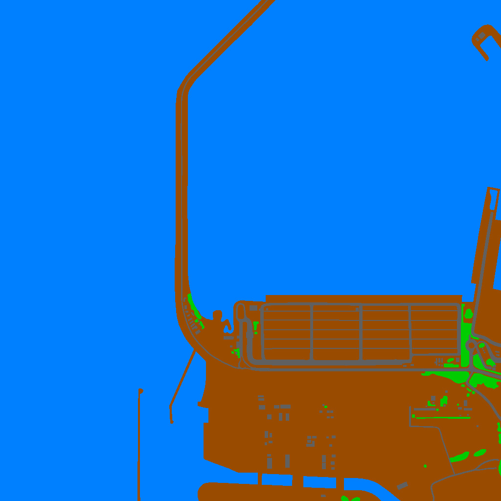
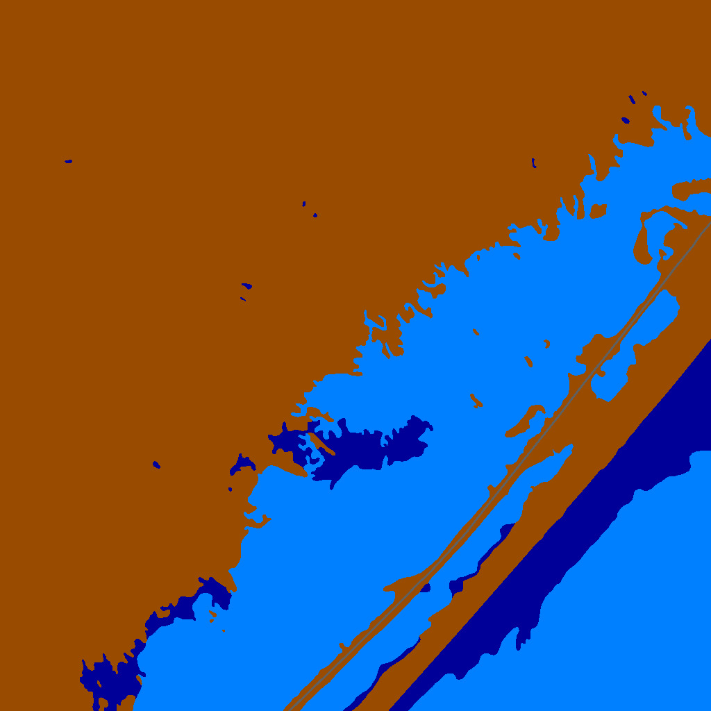
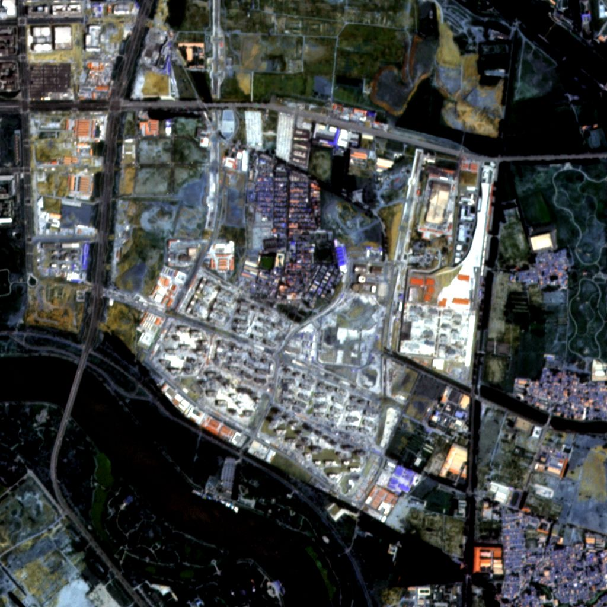
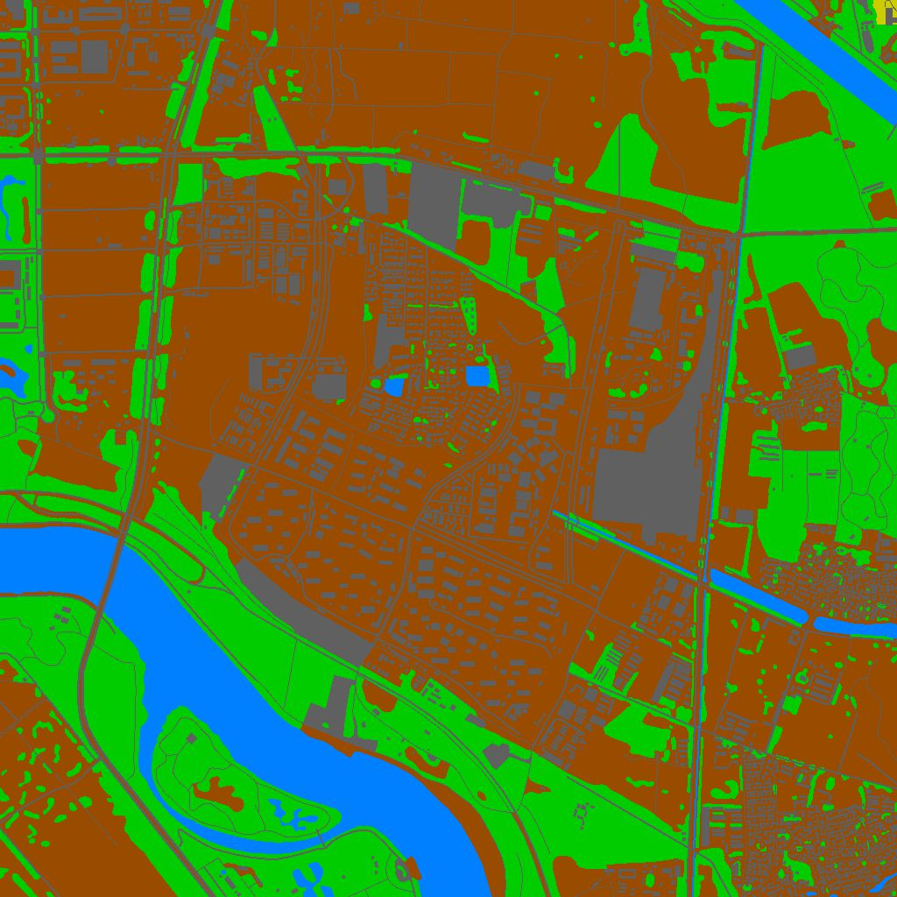
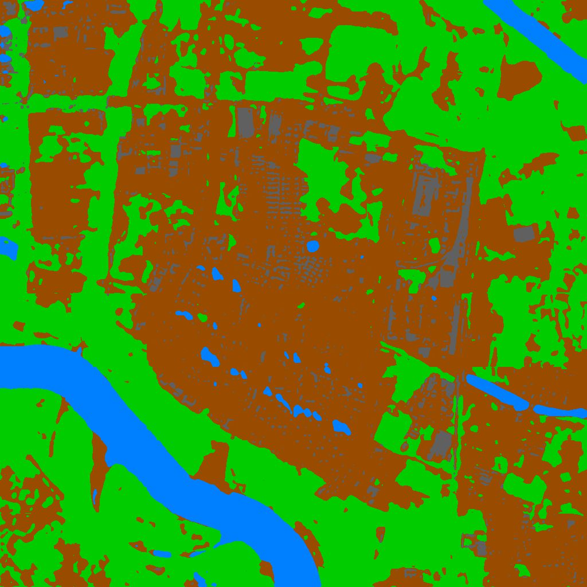

## Land Cover Classification by combining Convolutions and Attention

This repository contains the code for the method proposed in [Voelsen et al. 2021]( https://doi.org/10.1007/s41064-024-00299-7) 
for the task of multi-temporal land cover classification. 
The method combines convolutions and attention mechanisms to effectively capture both 
local spatial features and globale temporal features from satellite image time series. 

The implementation is written in python and uses the [pytorch library](https://pytorch.org/).

### Structure and contents: 
With this repository supervised land cover classification for satellite image time series can 
be performed. 
This includes model training, evaluation, and inference.

The repository is structured as follows:
- `code/`: Contains the implementation of the model, training, and evaluation scripts.
- `config files/`: Contains the configuration file to set the local path to the data folder.  
- `example/`: Contains configuration files and settings for running experiments of the included example on the [Dynamic Earth dataset](https://github.com/aysim/dynnet).


### Setup:
To set up the code for training and inferencing, please follow these steps:
1. Clone this repository
2. Prepare the example dataset: 
   1. Download the Dynamic Earth dataset from here: [Download Dynamic Earth dataset](https://mediatum.ub.tum.de/1650201)
   2. Set the path in `config files/storage_dirs.txt` to the folder where you stored the dataset.
   3. Copy the files `example/train.csv`, `example/val.csv`, `example/test.csv` into the dataset folder.
3. Install the conda environment by running `conda env create -f code/environment.yml` from an anaconda prompt. 
    Alternatively, you can install the required packages manually.
4. Activate the conda environment: `conda activate lc_transformer`
5. Navigate to the `code/` folder and run experiment by executing the command: `python main.py`. 
6. To adjust the training settings, modify the parameters in the `example/example_exp.sh` file 
    and run the script by executing `sh example/example_exp.sh`.

### Example: Training a model on the Dynamic Earth dataset: 
The free available [Dynamic Earth dataset](https://github.com/aysim/dynnet) serves as an example
for training and evaluating the proposed method.


The dataset contains Planet imagery for 75 areas of interest worldwide for a time period of 2 years combined with
monthly manually generated land cover labels for seven classes.
To train a model with this dataset the following steps are conducted:
- The 75 areas are splitted into 55 training, 10 validation, and 10 test areas, which is defined in the train.csv, 
    test.csv and val.csv files and corresponds to the suggested split from [Dynamic Earth dataset](https://github.com/aysim/dynnet).
- A pytorch dataset is created in the `code/datamanagement.py` file to provide a timeseries of images and labels
  of a specific length to the model. Default values are 12 timesteps (one image from january to december) and patches 
  of size 256x256 pixels.

#### Exemplary classificaiton results on the Dynamic Earth dataset:

F1-Scores on the test dataset for the exemplary model:

|  Model   | m F1  [%] | F1 Imp [%] | F1 Agr [%] | F1 For [%] | F1 Wet [%]| F1 Soil [%]|F1 Wat [%] |          Config file    |
|:--------:|:---------:|:----------:|:----------:|:----------:|:------:|:-------:|:---------:|:-----------------------:|
| Model P4 |   42.2    |    15.6    |    0.7     |    74.9    |  0.0   |  67.3   |   94.5    | `example/models/model_p1/run_model_p4.sh` |


Exemplary qualitative classification results on the test dataset: 

 
|                         Input Image                          |                         Ground Truth                          |                          Prediction                          |
|:------------------------------------------------------------:|:-------------------------------------------------------------:|:------------------------------------------------------------:|
|  |  |  |
|  |  |  |
|  |  |  |


### Citing
If you use this code for your research, please cite our paper
```
@article{Voelsen_2024,
AUTHOR = {Voelsen, Mirjana and Rottensteiner, Franz and Heipke, Christian},
TITLE = {Transformer models for Land Cover Classification with Satellite Image Time Series},
JOURNAL = {PFG – Journal of Photogrammetry, Remote Sensing and Geoinformation Science},
VOLUME = {92},
YEAR = {2024},
pages = {547 - 568},
DOI = {10.1007/s41064-024-00299-7}                
}
```
and/or the GitHub repository

### License
This project is licensed under the terms of the MIT license.

### Contact
If you have any questions, please contact me via GitHub or [Linkedin](https://de.linkedin.com/in/dr-mirjana-voelsen-8015841a8).

### Acknowledgements
I thank my supervisor [Prof. Franz Rottensteiner](https://www.researchgate.net/profile/Franz-Rottensteiner) for his 
support and the [Institute of Photogrammetry and GeoInformation](https://www.ipi.uni-hannover.de/de/) lead by 
[Prof. Christian Heipke](https://www.researchgate.net/profile/Christian-Heipke) for providing the possibility to do 
this research.

### References
[1] Toker, A., Kondmann, L., Weber, M., Eisenberg, M., Andres, C., Hu, J., Hoderlein, A., Senara, C., Davis, T., Cremers, D., Marchisio, G., Zhu, X.
(2022): DynamicEarthNet: Daily Multi-Spectral Satellite Dataset for Semantic Change Segmentation.
In: Proceedings of the IEEE/CVF Conference on Computer Vision and Pattern Recognition (CVPR).